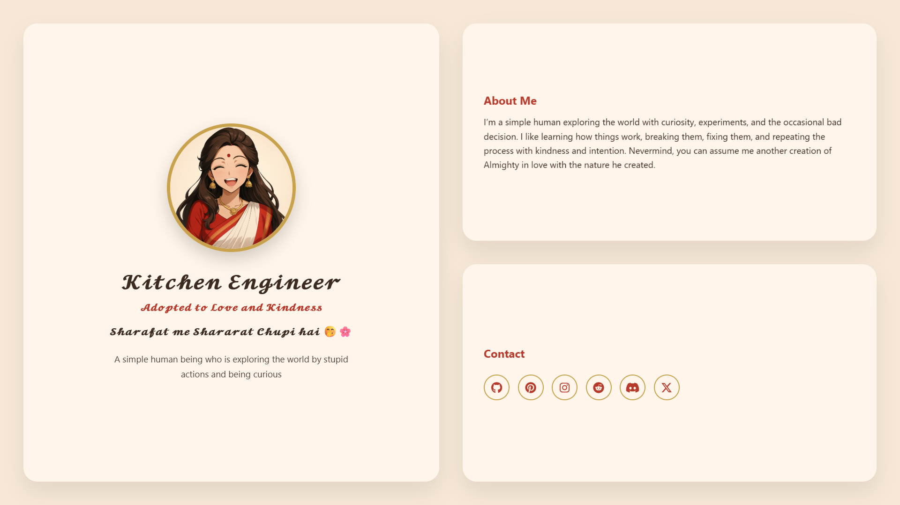
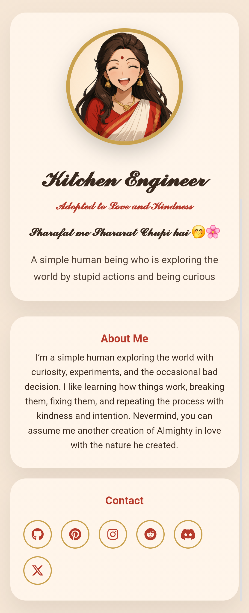

# 𝓚𝓲𝓽𝓬𝓱𝓮𝓷 𝓔𝓷𝓰𝓲𝓷𝓮𝓮𝓻
* 𝓢𝓱𝓪𝓻𝓪𝓯𝓪𝓽 𝓶𝓮 𝓢𝓱𝓪𝓻𝓪𝓻𝓪𝓽 𝓒𝓱𝓾𝓹𝓲 𝓱𝓪𝓲 🤭🌸 *

A personal profile and portfolio website built with simplicity, curiosity, and
human warmth in mind.

This space is not a résumé.  
It’s a quiet corner of the web where I explore ideas, learn through experiments,
and grow with kindness and intention.

---

## 🌐 Live Website
🔗 https://kitchenengineer1332.github.io/

---

## 🖼 Preview

### Desktop View


### Mobile View


---

## ✨ Features

- Clean, warm, human-centered design
- Responsive layout (desktop, tablet, mobile)
- Desktop-only interactive cards (hover-based)
- Touch-safe behavior on mobile devices
- Expandable social icons with brand colors
- No frameworks — just the web

---

## 🛠 Tech Stack

- **HTML** — structure
- **CSS** — layout, animations, responsiveness
- **JavaScript** — interactions
- **Font Awesome** — social icons

---

## 📁 Project Structure

```text
/
├── README.md
├── index.html
├── style.css
├── script.js
├── profile.png
└── screenshots/
    ├── desktop.png
    └── mobile.png
